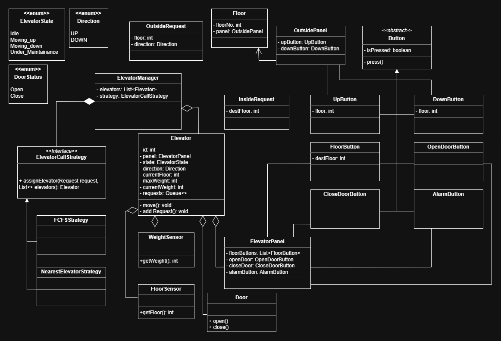

# Elevator-System-LLD

# UML Diagram

# Design Approach

I followed an object-oriented approach and tried to keep the design close to how a real elevator system works.

### Main ideas used in the design

- **Strategy Pattern**: Used for elevator assignment logic.
- **Modularity**: Every major component is placed in its own class.

## Elevator Assignment Strategy

I implemented the `ShortestSeekStrategy` for choosing an elevator.

The logic is simple:
- find the elevator closest to the requested floor
- ignore elevators under maintenance
- assign the request to the best match
